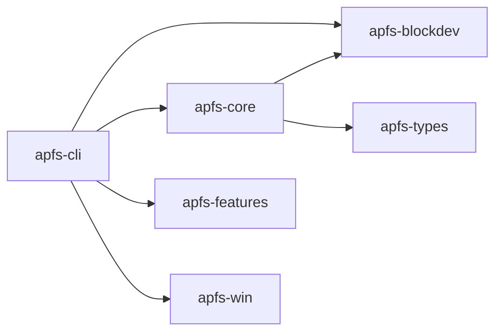

# Cargo Dependency Graph

Generated by `tools/cargo_dependency_graph.py`.

## Crates

| Crate | Member | Version |
|---|---|---|
| `apfs-types` | `crates/apfs-types` | `0.13.0` |
| `apfs-blockdev` | `crates/apfs-blockdev` | `0.13.0` |
| `apfs-core` | `crates/apfs-core` | `0.13.0` |
| `apfs-vfs` | `crates/apfs-vfs` | `0.18.0` |
| `apfs-win` | `crates/apfs-win` | `0.18.0` |
| `apfs-features` | `crates/apfs-features` | `0.19.0` |
| `apfs-fuse` | `crates/apfs-fuse` | `0.1.0` |
| `apfs-android` | `crates/apfs-android` | `0.1.0` |
| `apfs-crypto` | `crates/apfs-crypto` | `0.1.0` |
| `apfs-write-lab` | `crates/apfs-write-lab` | `0.1.0` |
| `apfs-cli` | `crates/apfs-cli` | `0.13.0` |
| `apfs-test` | `crates/apfs-test` | `0.13.0` |
| `xtask` | `xtask` | `0.13.0` |

## Path dependency edges

| From | To |
|---|---|
| `apfs-core` | `apfs-blockdev` |
| `apfs-core` | `apfs-types` |
| `apfs-cli` | `apfs-blockdev` |
| `apfs-cli` | `apfs-core` |
| `apfs-cli` | `apfs-features` |
| `apfs-cli` | `apfs-win` |
