# APFS-RS Design

Document version: 0.18.0  
Status: Current design ledger  
Date: 2026-06-24

## Current implementation architecture

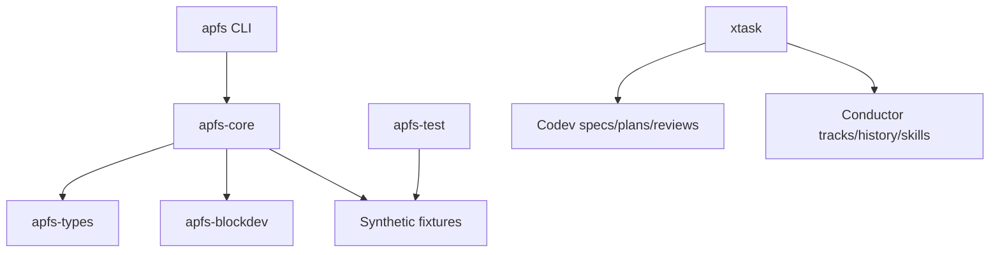

## Read-only inspection and resolver flow

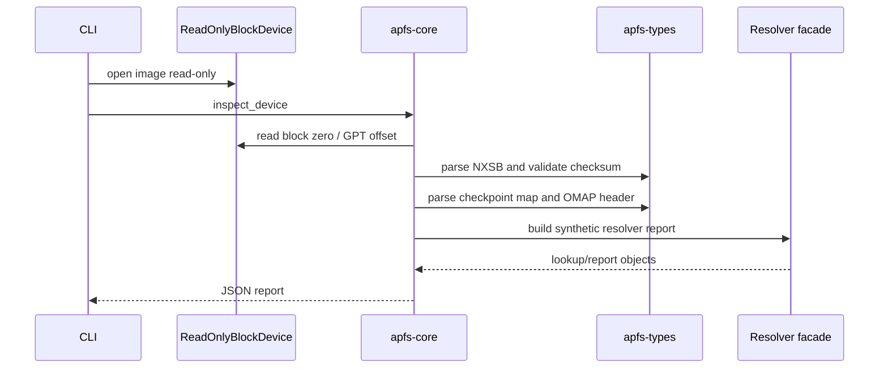

## Current directory/file-preview scaffold

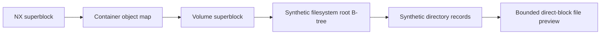

## Codev plus Conductor context model

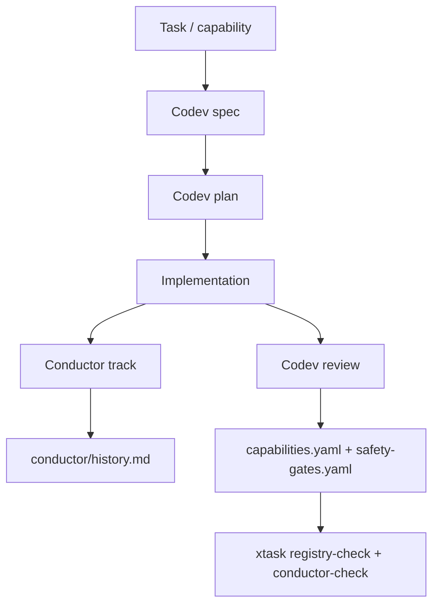

## Safety boundary

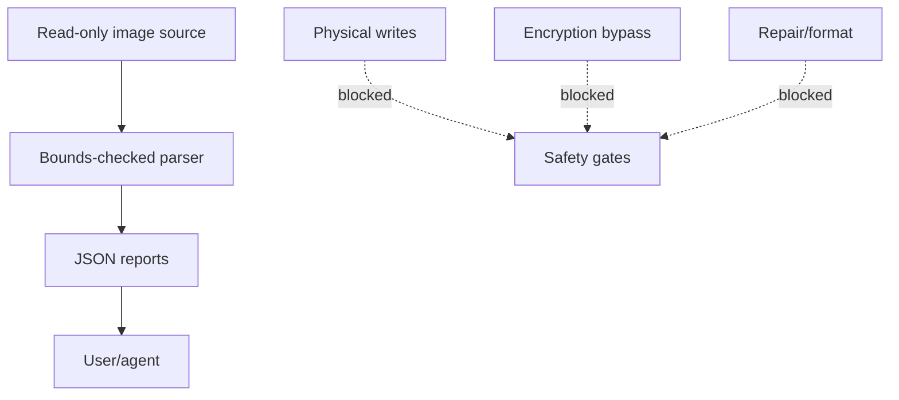

## Future target architecture

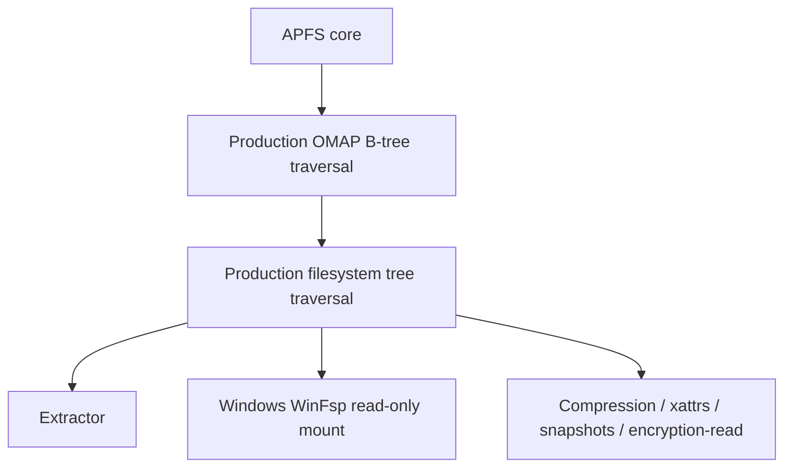

## v0.16 Additions: synthetic stat/extract and precompile validation

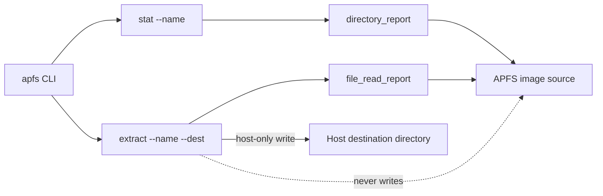

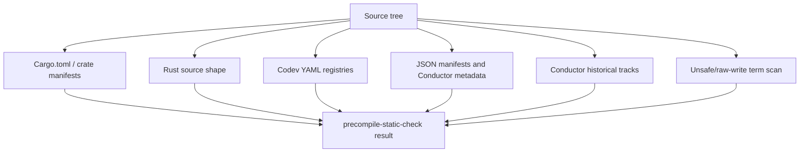

The precompile validation path is not a substitute for `cargo test`. It is a sandbox-friendly loop that catches repository-shape and obvious static hazards before the code reaches a Rust-enabled machine.

## v0.17.0 Cargoless quality loop

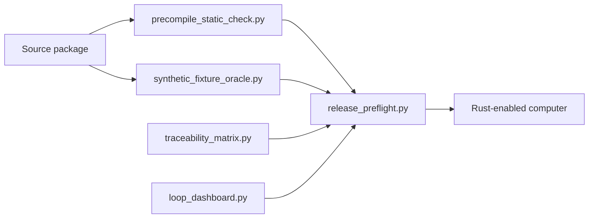

## v0.17.0 Batched implementation loop

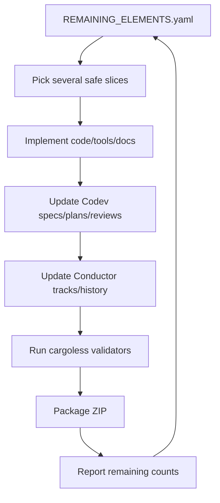


## v0.18.0 read-only adapter readiness

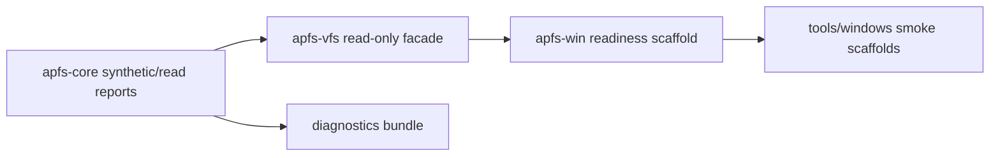

## v0.18.0 cargoless loop improvements

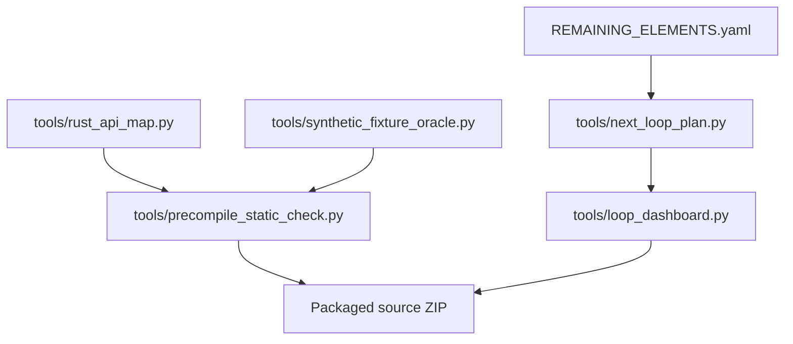

## Windows mount-plan scaffold

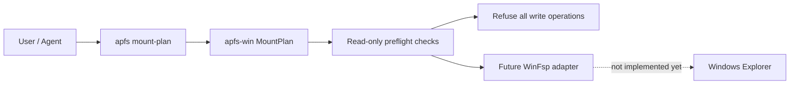

## Redacted diagnostics bundle

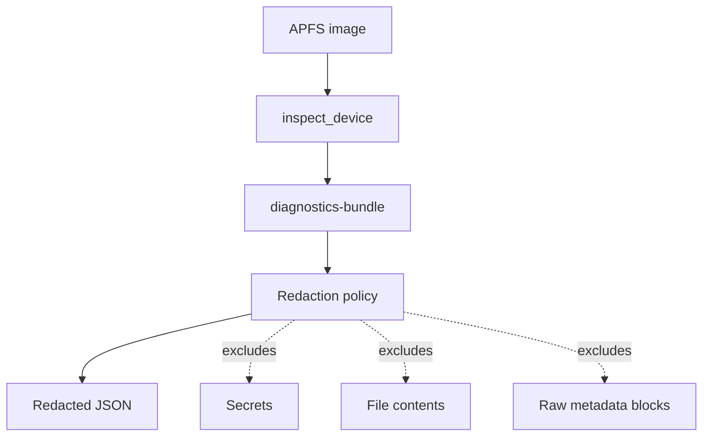

## Context integrity loop

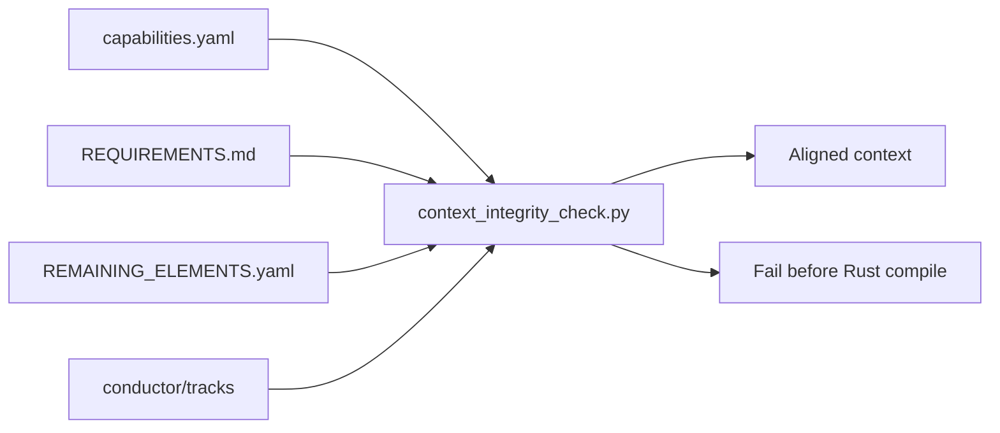


## v0.18.0 Diagnostics and Cargoless Review Loop

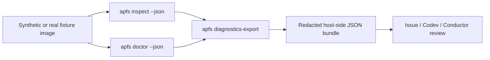

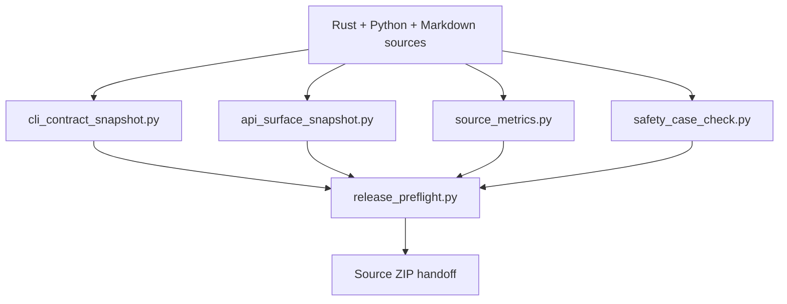

The diagnostics path is deliberately host-output-only and read-only with respect to APFS media. The cargoless review loop improves confidence before Rust compilation by checking context, CLI surface, API surface, source metrics, fixture manifests, safety case, and release-preflight readiness.


## v0.20.0 Advanced feature readiness layer

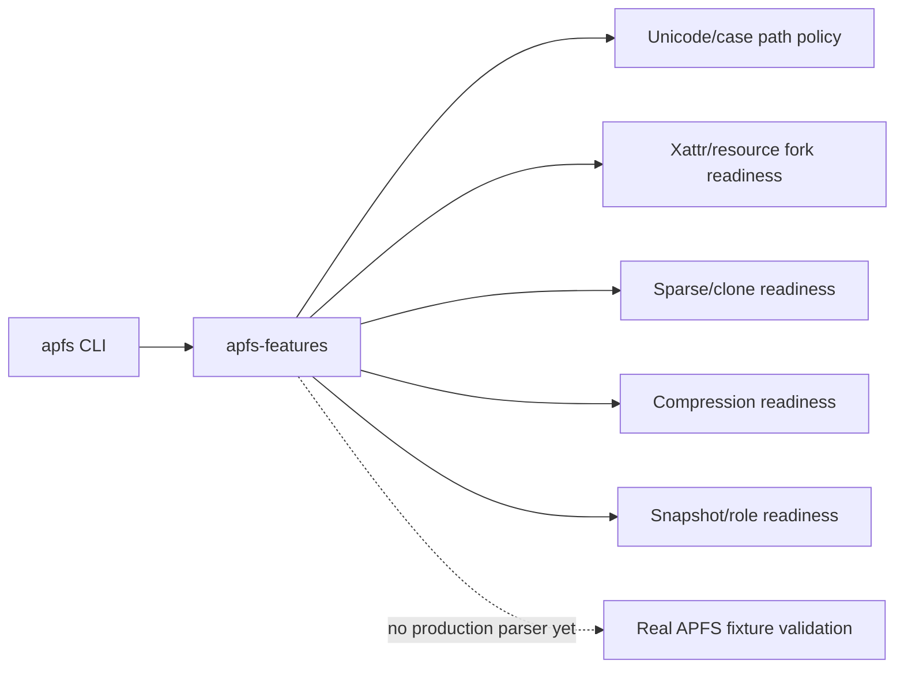

The advanced-feature layer is policy/report-only. It provides stable command/API surfaces for agents and users while preserving the rule that production support requires real APFS fixtures and parser validation.

## v0.20.0 Feature readiness snapshot

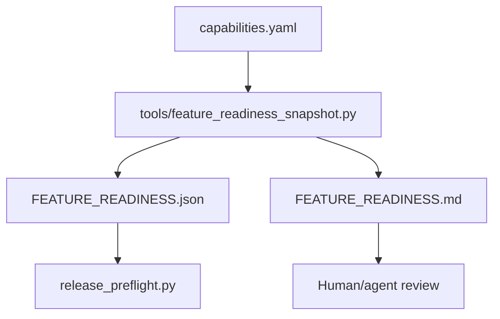

The snapshot keeps advanced feature readiness visible without claiming production support.

## v0.20.0 Version consistency loop

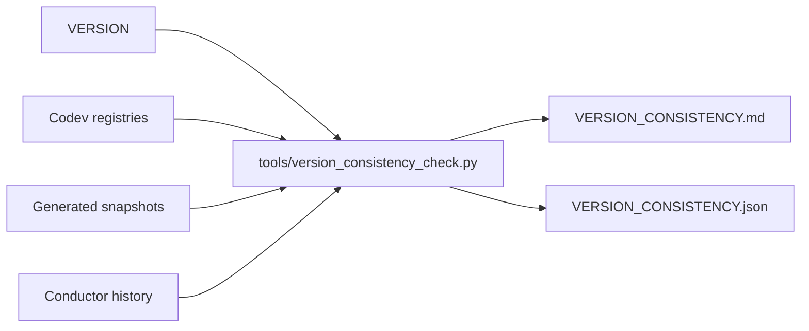

The version check reduces handoff drift when multiple scaffold loops run without Cargo.


## v0.20.0 handoff and adapter-readiness loop

```mermaid
flowchart TB
    CargoLog[Cargo output on local machine]
    Triage[cargo_error_to_tracks.py]
    Codev[Generated Codev task stubs]
    Conductor[Generated Conductor task tracks]
    Human[Maintainer review]
    Fix[Minimal compile/test fix]

    CargoLog --> Triage
    Triage --> Codev
    Triage --> Conductor
    Codev --> Human
    Conductor --> Human
    Human --> Fix
```

```mermaid
flowchart LR
    Core[apfs-core read-only API]
    VFS[apfs-vfs facade]
    Win[apfs-win readiness]
    Fuse[apfs-fuse readiness]
    Android[apfs-android readiness]
    Crypto[apfs-crypto readiness]
    WriteLab[apfs-write-lab readiness]

    Core --> VFS
    VFS --> Win
    VFS --> Fuse
    VFS --> Android
    Core -. policy only .-> Crypto
    Core -. disposable image planning only .-> WriteLab
```

## v0.21.0 Local handoff candidate loop

```mermaid
flowchart TD
    Env[local_env_doctor.py] --> Config[config_sanity_check.py]
    Config --> Static[precompile_static_check.py]
    Static --> Status[handoff_status.py]
    Status --> Manifest[repo_manifest.py]
    Manifest --> Cargo[First local cargo fmt/test/clippy]
    Cargo --> Triage[cargo_error_to_tracks.py]
    Triage --> Codev[Generated Codev tasks]
    Triage --> Conductor[Generated Conductor tracks]
```

The v0.21.0 loop turns the source package into a local handoff candidate. It still requires local Rust/Cargo execution before any production APFS claim.

## v0.21.0 Tooling configuration architecture

```mermaid
flowchart LR
    Toolchain[rust-toolchain.toml] --> Cargo[.cargo/config.toml]
    Cargo --> Tests[nextest config]
    Cargo --> Deny[deny.toml]
    Devcontainer[.devcontainer] --> Cargo
    PreCommit[pre-commit + typos + markdownlint] --> StaticChecks[Python/static checks]
    StaticChecks --> Handoff[HANDOFF_STATUS.md]
    StaticChecks --> Manifest[REPO_MANIFEST.md]
```


## v0.22.0 local handoff hardening

Added M-059 through M-064: local compile-loop orchestration, cargoless Cargo workspace audit, macOS fixture dry-run validation, WinFsp callback matrix, production-gap reporting, and batched-loop stop criteria. These do not reduce the 9 Windows read-only MVP production blockers because those require local Rust/macOS/Windows execution.

## Current-environment validation loop

```mermaid
flowchart LR
    Env[Tool inventory] --> Remaining[Remaining classifier]
    Remaining --> Matrix[Test/control matrix]
    Matrix --> Neg[Negative synthetic fixtures]
    Neg --> Audit[Archive audit]
    Audit --> Handoff[Local handoff pack]
```

This loop captures work that can be done before Rust/macOS/Windows execution and makes the stop condition explicit.


Version note: 0.23.0

## v0.25.0 Cargoless completion layer

```mermaid
flowchart TB
    Source[Source tree and synthetic fixtures]
    Offset[APFS offset audit]
    Golden[Golden output expectations]
    Dep[Dependency policy audit]
    Backlog[Backlog issue export]
    SelfTest[Current-environment self-test]
    Handoff[Local handoff package]

    Source --> Offset
    Source --> Golden
    Source --> Dep
    Source --> Backlog
    Offset --> SelfTest
    Golden --> SelfTest
    Dep --> SelfTest
    Backlog --> SelfTest
    SelfTest --> Handoff
```

This layer maximises validation in environments without Rust/Cargo, macOS APFS tools, or Windows/WinFsp. It is explicitly not production APFS validation.

## v0.25.0 Cargoless completion layer

```mermaid
flowchart TB
    Source[Source tree and synthetic fixtures]
    Offset[APFS offset audit]
    Golden[Golden output expectations]
    Dep[Dependency policy audit]
    Backlog[Backlog issue export]
    SelfTest[Current-environment self-test]
    Handoff[Local handoff package]

    Source --> Offset
    Source --> Golden
    Source --> Dep
    Source --> Backlog
    Offset --> SelfTest
    Golden --> SelfTest
    Dep --> SelfTest
    Backlog --> SelfTest
    SelfTest --> Handoff
```

This layer maximises validation in environments without Rust/Cargo, macOS APFS tools, or Windows/WinFsp. It is explicitly not production APFS validation.


## v0.26.0 Current-Environment Control Layer

```mermaid
flowchart TB
    Env[Current environment inventory] --> Tools[Tool capability matrix]
    Tools --> Plan[Local command plan]
    Plan --> Static[Rust static lint]
    Static --> Integrity[Package integrity audit]
    Integrity --> Blockers[MVP blocker tasklist]
    Blockers --> Brief[Agent handoff brief]
    Brief --> Local[Move to Rust/macOS/Windows machine]
```

The v0.26.0 layer makes the handoff boundary explicit: the current environment can validate context, packaging, synthetic fixtures, static source shape, and task planning, but production APFS behaviour still requires local Rust, real macOS APFS fixtures, and Windows WinFsp validation.

## v0.26.0 current-environment closure additions

- `M-088` — Source debt report.
- `M-089` — Production claim guard.
- `M-090` — Handoff manifest verifier.
- `M-091` — MVP blocker dependency DAG.
- `M-092` — Local migration command generator.
- `M-093` — Current-environment final report.

```mermaid
flowchart LR
    Debt[Source debt report] --> Claim[Production claim guard]
    Claim --> Manifest[Handoff manifest verification]
    Manifest --> Dag[MVP blocker DAG]
    Dag --> Commands[Local migration commands]
    Commands --> Final[Current environment final report]
```


## QA and documentation hardening flow

```mermaid
flowchart LR
    Source[Rust/Python source] --> Unit[Unit tests]
    Source --> Integration[Integration tests]
    Source --> E2E[CLI E2E tests]
    Source --> Property[Proptest + Hypothesis]
    Source --> Fuzz[cargo-fuzz]
    Source --> Mutation[cargo-mutants]
    Source --> Coverage[cargo-llvm-cov >= 90%]
    Source --> Profiling[Criterion benchmarks]
    Docs[Markdown + Codev + Conductor] --> Astro[Astro 7 static docs]
    Unit --> CI[Strict CI]
    Integration --> CI
    E2E --> CI
    Property --> CI
    Fuzz --> CI
    Mutation --> CI
    Coverage --> CI
    Profiling --> CI
    Astro --> CI
```


## v0.27.0 quality/docs hardening

Added strict CI quality gate scaffolding, >=90% coverage policy, unit/integration/E2E/property/fuzz/mutation/profiling test strategy, Astro 7 documentation-site scaffold, and cargoless audits for those additions.


```mermaid
flowchart LR
    PR[Pull Request] --> CI[Strict CI]
    CI --> Nextest[cargo nextest]
    CI --> Coverage[cargo llvm-cov >=90]
    CI --> Fuzz[cargo fuzz smoke]
    CI --> Mutants[cargo mutants]
    CI --> Supply[cargo deny/audit/vet]
    Docs[Astro 7 docs site] --> DocsAudit[docs-site-audit]
    Cargoless[Cargoless checks] --> CIQuality[ci-quality-gate-audit]
```

## v0.27.0 Strict quality and documentation layer

```mermaid
flowchart TB
    PR[Pull Request] --> Unit[Unit tests]
    PR --> Integration[Integration tests]
    PR --> E2E[End-to-end CLI tests]
    PR --> Prop[Property / Hypothesis-style tests]
    PR --> Fuzz[Fuzz smoke]
    PR --> Cov[Coverage >= 90%]
    Schedule[Scheduled CI] --> Mutation[Mutation testing]
    Schedule --> Profiling[Criterion profiling]
    Docs[Docs changes] --> Astro[Astro 7 + Starlight build]
    Unit --> Gate[Quality gate]
    Integration --> Gate
    E2E --> Gate
    Prop --> Gate
    Fuzz --> Gate
    Cov --> Gate
    Astro --> Gate
```

```mermaid
flowchart LR
    Markdown[Codev / Conductor / README docs] --> DocsSite[Astro 7 + Starlight docs-site]
    DocsSite --> Build[npm run build]
    Build --> ReleaseDocs[Published documentation artifact]
```

The v0.27.0 layer configures strict quality gates and an Astro 7/Starlight documentation site. These are configured but not yet executed in this environment because Rust/Cargo and npm package installation are not available here.


## v0.28.0 Quality Evidence Loop

```mermaid
flowchart TB
    Source[Source tree] --> Workflows[GitHub workflow policy audit]
    Source --> Tests[Test inventory report]
    Source --> Docs[Astro 7 docs package audit]
    Source --> Profiling[Profiling budget check]
    Tests --> Evidence[Quality gate evidence ledger]
    Workflows --> Evidence
    Docs --> Evidence
    Profiling --> Evidence
    Evidence --> Local[Local Rust/npm execution]
    Local --> Coverage[>=90% coverage, mutation, fuzz, profiling]
```

The current environment can validate the configuration and source-shape of these gates. It cannot execute Rust/Cargo, `cargo-mutants`, `cargo-fuzz`, `cargo-llvm-cov`, or the Astro npm build until the project is moved to a local/CI machine with those tools installed.


## v0.29.0 Repo Hardening and Automation

- `M-110` — GitHub Actions hardening with zizmor/actionlint policy.
- `M-111` — GitHub Actions pinning and permissions audit.
- `M-112` — cargo-vet supply-chain review policy.
- `M-113` — SLSA and artifact attestation verification plan.
- `M-114` — cargo-dist and release-plz automation scaffold.
- `M-115` — OpenSSF Scorecard and dependency-review workflow scaffold.
- `M-116` — Astro 7 documentation quality hardening.
- `M-117` — Benchmark regression and optional CodSpeed readiness.
- `M-118` — Bleeding-edge repo hardening audit aggregator.

```mermaid
flowchart LR
    PR[Pull Request] --> GHA[GitHub Actions]
    GHA --> Z[zizmor/actionlint]
    GHA --> SC[Scorecard + Dependency Review]
    GHA --> CV[cargo-vet / deny / audit]
    GHA --> QA[fmt clippy nextest llvm-cov mutants fuzz]
    QA --> EV[Quality Gate Evidence]
    SC --> EV
    Z --> EV
    CV --> EV
```
