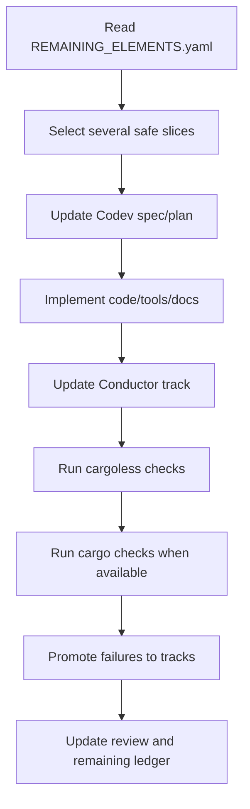

# Batched Development Loop

Version: 0.21.0

Use this loop for future local or agent-assisted development.

## Loop rules

- Batch related safe slices together.
- Keep APFS media read-only.
- Promote failures to Codev/Conductor instead of hiding them.
- Keep `REQUIREMENTS.md`, `DESIGN.md`, `REMAINING_ELEMENTS.yaml`, Codev, and Conductor in sync.
- Do not erase history; add new tracks.
