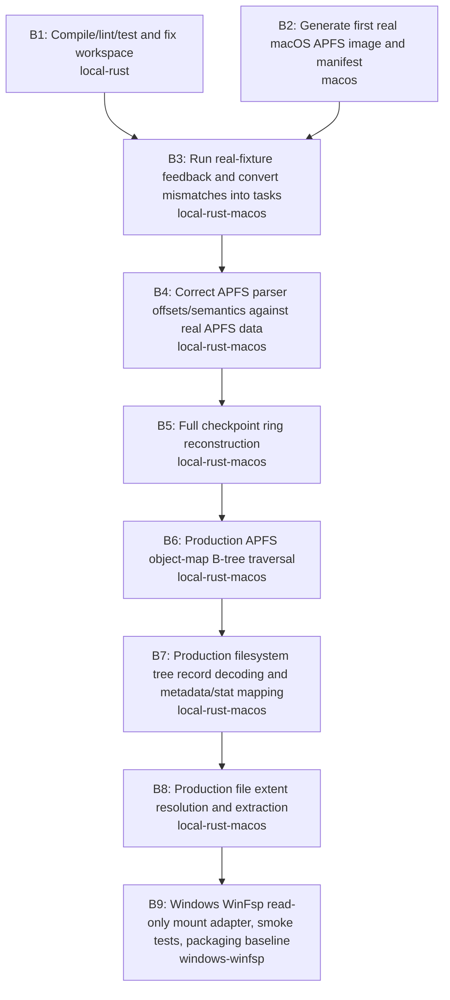

# MVP Blocker Dependency DAG

Blockers: `9`

## Ordered blockers
- `B1` **Compile/lint/test and fix workspace** — environment: `local-rust`; depends on: `none`
- `B2` **Generate first real macOS APFS image and manifest** — environment: `macos`; depends on: `none`
- `B3` **Run real-fixture feedback and convert mismatches into tasks** — environment: `local-rust-macos`; depends on: `B1, B2`
- `B4` **Correct APFS parser offsets/semantics against real APFS data** — environment: `local-rust-macos`; depends on: `B3`
- `B5` **Full checkpoint ring reconstruction** — environment: `local-rust-macos`; depends on: `B4`
- `B6` **Production APFS object-map B-tree traversal** — environment: `local-rust-macos`; depends on: `B5`
- `B7` **Production filesystem tree record decoding and metadata/stat mapping** — environment: `local-rust-macos`; depends on: `B6`
- `B8` **Production file extent resolution and extraction** — environment: `local-rust-macos`; depends on: `B7`
- `B9` **Windows WinFsp read-only mount adapter, smoke tests, packaging baseline** — environment: `windows-winfsp`; depends on: `B8`
