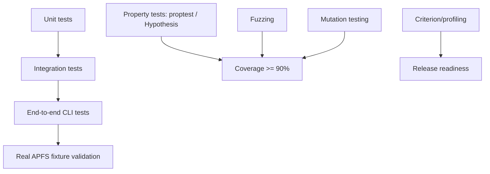

# APFS-RS Test Strategy

Version: 0.27.0

## Test layers

## Current setup

- Rust property tests: `crates/apfs-types/tests/property_nx_superblock.rs`.
- Core integration tests: `crates/apfs-core/tests/integration_inspect.rs`.
- CLI e2e tests: `crates/apfs-cli/tests/e2e_cli.rs`.
- Optional Python Hypothesis tests: `python_tests/test_fixture_properties.py`.
- Fuzz targets: `fuzz/fuzz_targets/`.
- Benchmark/profiling scaffold: `crates/apfs-core/benches/inspect_synthetic.rs`.
- CI quality gate workflow: `.github/workflows/quality-gates.yml`.

## Coverage target

Line coverage target: **>= 90%** for the workspace using `cargo llvm-cov` once the workspace compiles locally.
