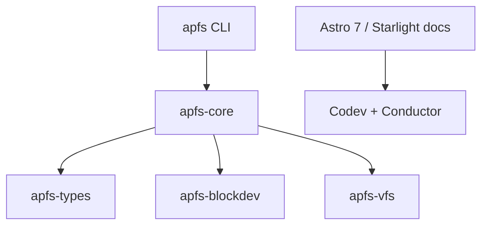

```mermaid
flowchart TB
  CLI[apfs CLI] --> Core[apfs-core]
  Core --> Types[apfs-types]
  Core --> BlockDev[apfs-blockdev]
  Core --> VFS[apfs-vfs]
  Docs[Astro 7 / Starlight docs] --> Context[Codev + Conductor]
```

The current implementation is read-only and heavily scaffolded around synthetic fixtures.
